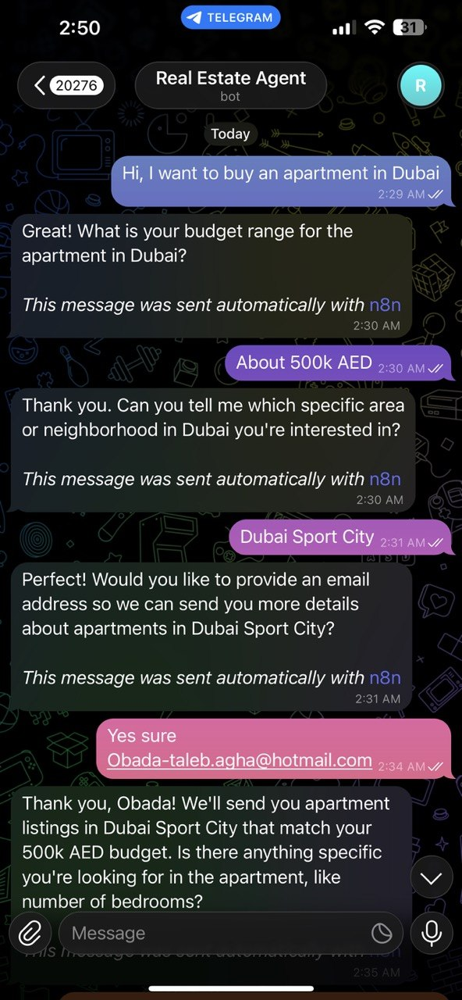
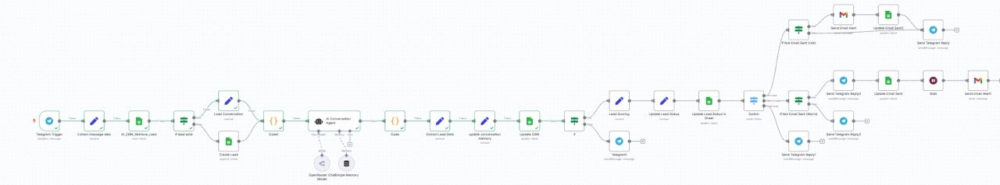

# 🏢 AI Real Estate Lead Qualification & Automation System

An end-to-end automated lead qualification system built with n8n, OpenAI, and Telegram Bot API. It receives incoming property inquiries, uses AI agents to qualify buyer preferences (budget, location, intent), and routes structured data to CRM pipelines.

---

## 📹 Live Video Demo
Watch the 2-minute walkthrough showing the bot processing real estate leads in real-time:
👉 [Watch the Live Demo Here](ضع_رابط_الفيديو_هنا)

---

## 📸 System Screenshots

| Telegram AI Assistant | n8n Automation Workflow |
| :---: | :---: |
|  |  |

---

## 🌟 Key Features
- Instant Ingestion: Captures inquiries via Telegram Webhooks in real-time.
- AI Intent Scoring: Parses buyer responses into structured JSON (Budget, Urgency, Property Type).
- Automated Routing: Automatically pushes high-priority leads to CRM pipelines using n8n workflows.
- Error Handling: Built-in fallbacks to manage incomplete user responses.

---

## 🛠 Tech Stack
- Workflow Engine: n8n
- AI Agent / LLM: OpenAI API
- Messaging API: Telegram Bot API
- Integrations: Webhooks / HTTP Requests / JSON Parsing

---

## 🚀 How to Import & Setup
1. Download the real_estate_lead_qualification.json file from the n8n_workflows/ folder.
2. Open your n8n dashboard and click Import from File.
3. Set up your credentials (OpenAI & Telegram API Keys) as outlined in .env.example.
